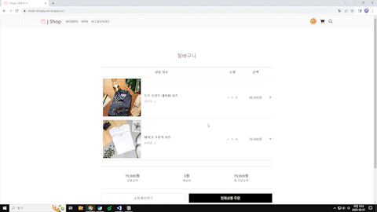

# J Shop(쇼핑몰 만들기)

## [클릭😊](https://nextjs-shoppy.vercel.app)

### 제작 기간

2023-07-14 ~ 2023-08-01

### 목적

Next.js, Tailwind, Sanity, Vercel, SWR, NextAuth 등 사용법 익히기 및 간단한 쇼핑몰과 유사한 서비스 만들어보기

- ❗ 과거에 React와 Firebase로 만들었던 [프로젝트](https://github.com/jeong922/shoppy)를 Next.js 복습할 겸 다시 만들어보았다. 그리고 최근에 강의를 들으며 배웠던 것들을 최대한 활용해 만들어보았다.
- Headless CMS인 Sanity를 이용해 데이터를 저장하였다. Sanity를 사용한 이유는 최근에 node.js를 찍먹해 보았지만 직접 백엔드를 구현할 자신이 없었고, 데이터가 업데이트 되면 즉각적으로 반영이 되며 최근 Next.js강의를 통해 배우기도 했기 때문에 사용하였다.
- Tailwind를 이용해 CSS 작업을 했다. Tailwind를 사용한 이유는 코드가 난잡해 보일 수도 있지만 클래스 이름 때문에 고민하지 않아도 되고 빠르게 사용하기 좋기 때문이다.
- 네트워크 상태 관리 라이브러리로 SWR를 사용한 이유는 최근에 Next.js를 배우면서 배우기도 했고 Next.js를 만든 Vercel이 만들었기 때문이다.
- NextAuth를 이용해 로그인 서비스를 구현하였다. 사용한 이유는 최근에 강의를 통해 배웠기 때문에 복습을 해보고자 사용했다.
- 배포는 Vercel을 사용하였다.

### 구성

❗ 미적 센스가 없어서 전체적 디자인이 좀 구리다..😅

- 로그인

  - NextAuth를 이용해 로그인 기능을 구현하였고 지금은 구글과 깃허브로 로그인이 가능하다.
  - NextAuth에서 제공하는 UI가 아닌 로그인 버튼을 누르면 직접 만든 페이지로 이동하도록 설정하였다.
  - 처음으로 로그인 했을 경우 사용자 정보를 sanity를 이용해 저장하도록 구현하였다.
  

    
  

- 홈

  - 새로 등록된 순서대로 제품 전체 목록을 보여준다.
  - 나름 예전에 만들어본 캐러셀 슬라이드를 이용해 배너를 만들어 허전한 부분을 채워보았다…
  

    
  

- 제품 목록

  - 홈에서는 제품 전체 목록을 보여주지만 women, men, acc-shoes 페이지에 따라 카테고리가 일치하는 제품들만 목록으로 보여준다.
  

    
  

- 제품 상세 페이지

  - 제품 이름, 이미지, 사이즈 가격, 카테고리, 설명, 위시리스트 버튼, 장바구니 담기 버튼으로 구성 되어 있다.
  - 위시리스트 버튼(하트모양 버튼)을 누르면 위시리스트에 제품이 등록 된다.
  - 사이즈 선택을 하지 않으면 장바구니 버튼이 활성화 되지 않도록 만들었으며 사이즈 선택 후 장바구니 버튼을 누르면 제품이 장바구니에 담기게 된다.
  

    
  

- 제품 등록

  - 특정 사용자만 제품을 등록할 수 있도록 구현하고 싶었다. 방법을 고민하다가 user 정보에서 IsAdmin이 true인 경우만 접근이 가능하도록 만들었다.
  - 제품 이름, 제품 이미지, 사이즈, 카테고리, 가격, 제품 설명을 입력하도록 만들었고 제품 등록을 누르면 제품이 등록 된다.
  

    
  

- 장바구니

  - 장바구니에 담긴 제품 목록을 보여주며 제품 목록 아래에는 제품 금액, 배송비, 총 주문금액을 보여준다.
  - 실제 서비스가 아니므로 주문 및 결제 기능은 만들지 않았다.
  

    
  

- 검색

  - 검색어를 입력하기 전에는 최신 등록 제품을 10개 보여주도록 구현 하였다.
  - 입력한 검색어와 제품 이름이 일부 일치하는 경우 그 제품들을 보여주도록 구현하였다.
  - 검색어가 변할때 마다 계속 데이터를 요청하게 되면 성능이 좋지 못하기 때문에 디바운스를 이용해 성능 개선을 하였다.
  

    
  

- 마이페이지

  - 회원정보 수정 페이지와 위시리스트로 구성 된다.
  - 회원정보 수정

    - 이메일을 제외한 이름, 이메일, 전화번호, 주소, 이미지를 변경 가능 하다.(실제 서비스가 아니기 때문에 이정도만 입력 및 변경 가능하도록 만들었다.)
    

      
      
    

  - 위시리스트
    - 제품 사진 오른쪽 하든 하트모양 버튼이나 제품 상세페이지 하트모양 버튼을 누르게 되면 위시리스트에 제품이 등록 된다. 하트 버튼을 한번 더 눌러 해제 하게 되면 위시리스트에서 삭제된다.(UI가 바로 업데이트 되지는 않는다.)
    

      
    

        

      
    

### 배운 점 및 어려웠던 점

- RESTful API는 기본중의 기본이지만 써본적이 없었던 것 같다. 이번 프로젝트를 하면서 RESTful API를 써야 했기 때문에 조금 힘들었지만 장인까지는 되지 못했지만 그래도 어느정도 이해하게 된 것 같다.
- sanity를 이용해 데이터베이스를 만들었는데 schema를 작성 하는 것이 익숙하지 않다보니 어려웠다. 머릿속에는 대충 이렇게 구성이 되겠구나 생각했지만 막상 작성하려고 하다보니 이게 맞나라는 생각이 많이 들었다. 프로젝트를 진행하면서 계속 수정했다.
- 프로필 업데이트 기능을 만드는데 생각보다 복잡해서 오래걸렸다. 제일 고통스러웠던 부분은 프로필 이미지 변경 기능인데 여러 방법을 시도하다가 결국 sanity에 기본 이미지를 하나 저장해 두고 그 이미지를 첫 로그인시 user 데이터베이스가 만들어질때 기본 이미지를 넣어주고 나중에 사용자가 다른 이미지로 변경 가능하게 만들었다.
- 어느정도 이것저것 만들어봤다고 생각했는데 프로젝트 디자인이나 UI 구현하는 것이 좀 부족하다는 느낌이 들어서 CSS 장인이 되도록 공부를 좀 더 해야 될 것 같다.
- 좋아요(위시리스트)를 만들면서 UI 업데이트 부분 때문에 좀 힘들었다. 배웠던거 그대로 응용해서 만들었지만 완벽하게 이해하지 못해서 그런지 시간이 많이 걸렸고 하트가 해제되면 목록에서 바로 삭제되게 만들고 싶었지만 일단 동작에는 문제가 없어 이부분은 차후 고민이 좀 필요할 것 같다.
- 모든 것을 완벽하게 이해한다는 것은 무리이긴 하지만 프로젝트를 만들면서 사용한 것들과 부족한 부분에 대해 다시 한번 생각해 봐야 할 것 같다.
